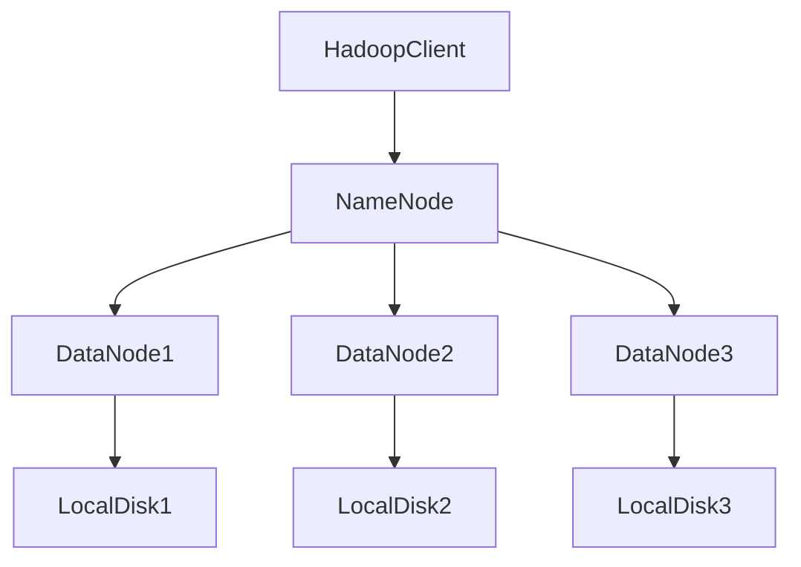

# 1. HDFS(Hadoop Distributed File System)
- HDFS是Hadoop分布式文件储存系统，主要用于解决大数据的储存问题，分布式意味着HDFS是横跨在多台计算机上的储存系统。H
- HDFS是一种能够在普通硬件上运行的分布式文件系统，它是高度容错的，适用于具有大数据集的应用系统，非常适合纯村大型数据；
- HDFS使用堕胎计算机储存文件，并且提供统一的访问接口，像是访问一个普通文件系统一样使用分布式文件系统。

其主要的结构为

                          

                       
