MySQL
=================================

# Chapter 1 MySQL 基础知识
## Section 1.1 MySQL概述
### 1. 数据库的相关概念
**数据库(DataBase, DB)**： 存储数据的仓库， 数据是有组织的进行储存

**数据管理系统(Database Management System, DBMS)**： 操纵和管理数据的大型软件

**SQL(Structed Query Language)**：操作关系型数据库的编程语言，定义了一套操作关系型数据库统一标准

### 2. MySQL下载
Windows: [MySQL](https://dev.mysql.com/downloads/installer/)
在安装时需要选择Full Install， 需要耗时几分钟
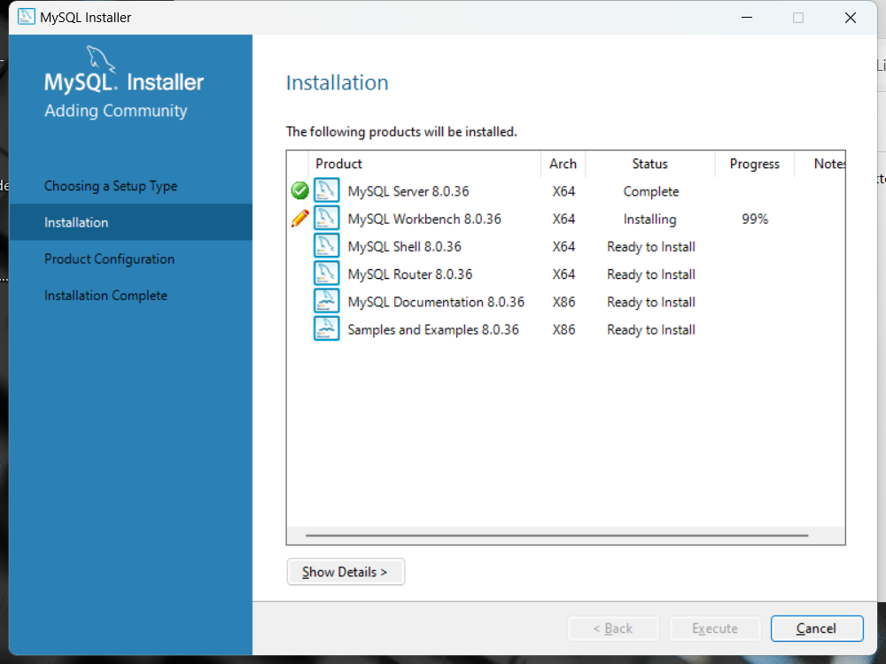

### 3. MySQL启动与停止
方法1： win+R -> services.msc -> 找到MySQL80 右键可以控制启动以及停止

方法2： cmd 以管理员身份运行 -> 输入命令行 
`net start mysql80` / `net stop mysql80`
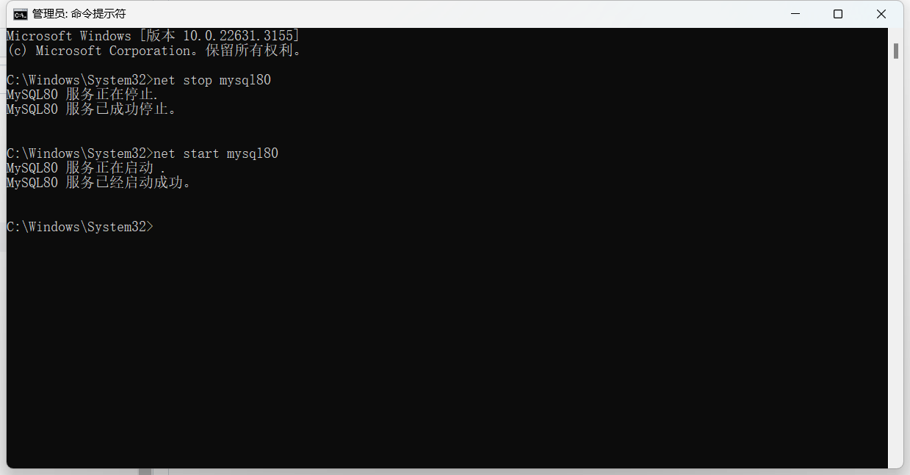

### 4. MySQL客户端连接
方法1： 利用MySQL提供的客户端命令行工具 `MySQL 8.0 Command Line Client`
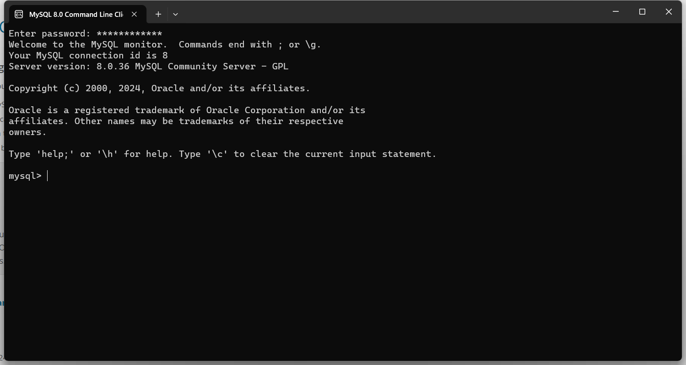

方法2： 利用windows命令行连接`mysql -u root -p`

### 5. 数据模型
1. 数据模型： DBMS用来操作数据库， 而每个数据库包含多个表结构，数据就是存储在表结构中， 这个表被称为**二维表**。

2. 关系型数据库(RDBMS)：
   - 概念： 建立在关系模型基础上，由多张互相连接的二维表组成的数据库。
   - 特点： （1）使用表存储数据， 格式统一， 便于维护； （2） 使用SQL语言操作，标准统一，使用方便；


## Section 1.2 SQL基本语句
### 1. SQL通用语法
（1） SQL语句可以单行或者多行书写，以分号结尾。

（2） SQL语句可以使用空格/缩进来增强语句的可读性。

（3） MySQL数据库的SQL语句不区分大小写， 关键字建议使用大写

（4） 注释：
   - 单行注释： `--`注释内容或者`#`注释内容（MySQL特有）
   - 多行注释： `/*注释内容*/`
   - 
----------------
### 2. SQL语句的分类
（1） DDL(Data Definition Language)： 数据定义语言，用来定义数据库对象（数据库，表，字段）；

（2） DML(Data Manipulation Language)： 数据操作语言， 用来对数据表中的数据进行增删改操作；

（3） DQL(Data Query Language)：数据查询语言，用来查询数据库中表的记录；

（4） DCL(Data Control Language)：数据控制语言，用来创建数据库用户，控制数据库的访问权限；

----------------
### 3. DDL语句
#### （1）数据库操作
  - **查询**： 查询所有数据库 `SHOW DATABASES`， 查询当前数据库  `SHOW DATABASE()`
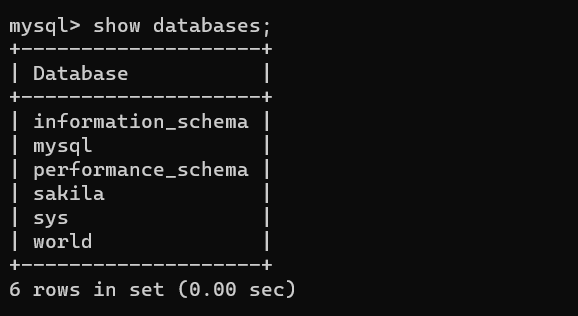
    
  - **创建**： `CREATE DATABASE [IF NOT EXISTS] 数据库名 [DEFAULT CHARSET 字符集名] [COLLATE 排序规则] `； 上面的语句中所有的方括号中的内容都是可选的， 第一个括号中的`[IF NOT EXISTS]`如果没有并且你创建的Database已经存在则会报错。
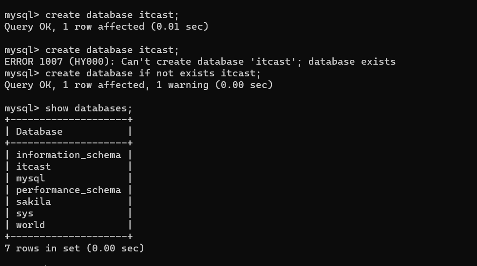
    
  - **删除**： `DROP DATABASE [IF EXISTS] 数据库名`
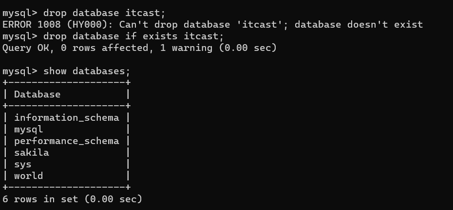

  - **使用**： `USE 数据库名`
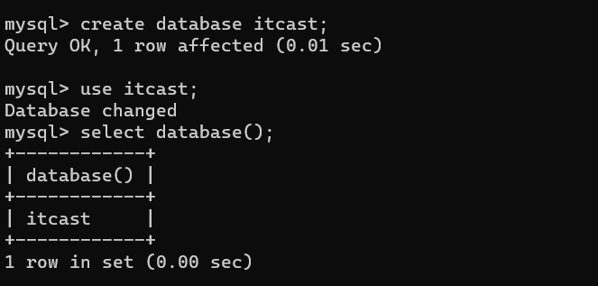

#### （2）表操作-查询
  - **查询当前数据库所有表**：`SHOW TABLES`;
    
  - **查询表结构**: `DESC 表名`；
   
  - **查询指定表的建表语句**： `SHOW CREATE TABLE 表名`

 #### （3）表操作-创建
  ```
    CREATE TABLE 表名(
      字段1 字段类型[COMMENT 字段1注释]
      字段2 字段类型[COMMENT 字段2注释]
      字段3 字段类型[COMMENT 字段3注释]
   )[COMMENT 标注释]
  ```
 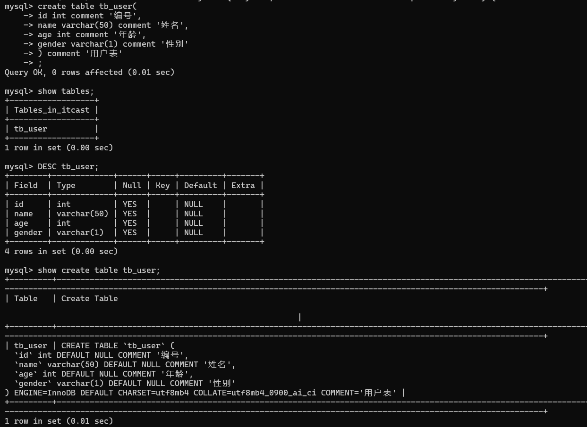

#### （4）表操作-数据类型
   **数值类型** 
| 类型 | 大小 | 有符号(SIGNED)范围 | 无符号(UNSIGNED)范围 | 描述 |
| :---: | :---: | :---: | :---: | :---: |
| TINYINT | 1 byte | (-128, 127) | (0, 255) | 小整数值 |
| SMALLINT | 2 bytes | (-32768, 32767) | (0, 65535) | 大整数值 |
| MEDIUMINT | 3 bytts | (-8388608, 8388607) | (0, 16777215) | 大整数值 |
| INT或 INTEGER | 4 bytes | (-2147483648, 2147483647) | (0, 4294967295) | 大整数值 |
| BIGINT | 8 bytes | (-2^63, 2^63-1) | (0, 2^64-1) | 极大整数值 |
| FLOAT | 4 bytes | (-3.402823466 E+38,3.402823466351 E+38) | 0 和 (1.175494351 E-38,3.402823466 E+38) | 单精度深点数值 |
| DOUBLE | 8 bytes | (-1.7976931348623157 E+308,1.7976931348623157 E+308) | 0 和 (2.2250738585072014 E-308,1.7976931348623157 E+308) | 双精度浑点数值 |
| DECIMAL |  | 依赖于M(精度) 和D (标度) 的值 | 依赖于M (精度) 和D (标度) 的值 | 小数值 (精碥定点数) |

**字符串类型**
   | 类型 | 大小 | 描述 |
   | :---: | :---: | :---: |
   | CHAR | 0-255 bytes | 定长字符串 |
   | VARCHAR | 0 - 65535 bytes | 变长字符串 |
   | TINYBLOB | 0 - 255 bytes | 不超过 255 个字符的二进制数据 |
   | TINYTEXT | 0 - 255 bytes | 短文本字符串 |
   | BLOB | 0 - 65535 bytes | 二进制形式的长文本数据 |
   | TEXT | 0 - 65535 bytes | 长文本数据 |
   | MEDIUMBLOB | 0-16 777 215 bytes | 二进制形式的中等长度文本数据 |
   | MEDIUMTEXT | 0-16 777 215 bytes | 中等长度文本数据 |
   | LONGBLOB | 0- 4 294 967 295 bytes | 二进制形式的极大文本数据 |
   | LONGTEXT | 0- 4 294 967 295 bytes | 极大文本数据 |

   一般我们只是用`CHAR` 和`VARCHAR`，其余类型一般不使用，我们虽然最开始都要指定定长，但是CHAR对于多于位置会用0补充（性能好，不需要判断占用空间），但是对于VARCHAR来说它会根据输入来判断占用空间（性能相对较差）。
   - 例子1： 如果我们想要存储用户名，规定其最长长度不得大于50位，此时使用`VARCHAR(50)`更好，因为用户输入的用户名不一样长。
   - 例子2： 如果想要储存用户性别， 此时推荐使用`CHAR(1)`，因为性别的输入固定长度的。

**日期类型**
| 类型 | 大小 | 范围 | 格式 | 描述 |
| :---: | :---: | :---: | :---: | :---: |
| DATE | 3 | 1000-01-01 至 9999-12-31 | YYYY-MM-DD | 日期值 |
| TIME | 3 | -838: 59: 59 至 838:59:59 | HH:MM:SS | 时间值或持综时间 |
| YEAR | 1 | 1901 至 2155 | YYYY | 年份值 |
| DATETIME | 8 | 1000-01-01 00:00:00 至 9999-12-31 23:59:59 | YYYY-MM-DD HH:MM:SS | 混合日期和时间值 |
| TIMESTAMP | 4 | 1970-01-01 00:00:01 至 2038-01-19 03:14:07 | YYYY-MM-DD HH:MM:SS | 混合日期和时间值，时间载 |

- 例子： 如果我们想要存储用户的生日，则使用`DATE`即可，因为生日只需要记录年月日。

**实际例子**
设计一张员工信息表，要求如下:
- 1. 编号 (纯数字)
- 2. 员工工号 (字符串类型, 长度不超过10位)
- 3. 员工姓名 (字符串类型, 长度不超过10位)
- 4. 性别(男/女, 存储一个汉字)
- 5. 年龄 (正常人年龄，不可能存储负数)
- 6. 身份证号 (二代身份证号均为18位，身份证中有X这样的字符)
- 7. 入职时间 (取值年月日即可)

其SQL语句如下：
```
create table emp(
   id INT comment '编号',
   workno VARCHAR(10) comment '工号',
   name VARCHAR(10) comment '姓名',
   gender CHAR(1) comment '性别',
   age TINYINT UNSIGNED comment '年龄',
   idcard CHAR(18) comment '身份证号',
   entrydate DATE comment '入职时间'
) comment '员工信息表';
```

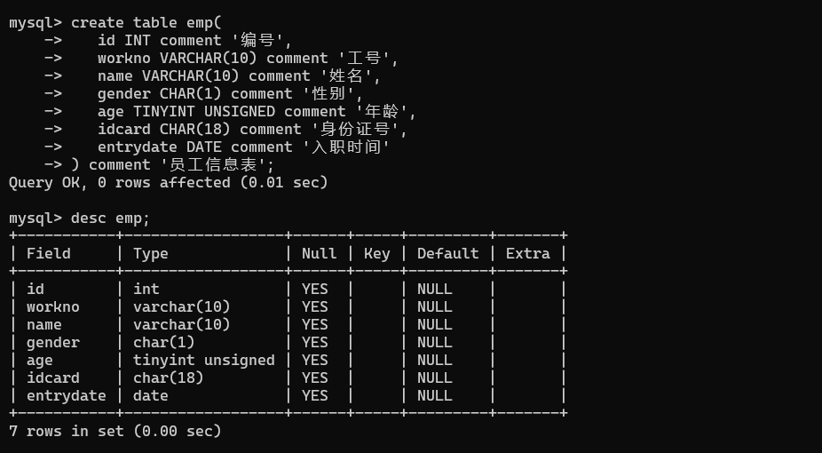

#### （5）表操作-修改
**添加字段**: `ALTER TABLE 表名 ADD 字段名 类型（长度） [COMMENT 注释] [约束]`

例子： 在上面的表格`emp`中增加一个新的字段`nickname`（不超过20个字符）。

`  alter table emp add nickname varchar(20) comment '昵称';`


**修改数据类型**： `ALTER TABLE 表名 MODIFY 字段名 新数据类型（长度）`


**修改字段名和字段类型**：`ALTER TABLE 表名 CHANGE 旧字段名 新字段名 类型（长度） [COMMENT 注释] [约束]`


例子： 将`emp`表中的`nickname`字段修改为`username`，类型位`VARCHAR(30)`。

` alter table emp change nickname username varchar(30) comment '用户名' ;`


**删除字段**: `ALTER TABLE 表名 DROP 字段名`

例子： 将`emp`表中的`username`字段删除。

` alter table emp drop username;`

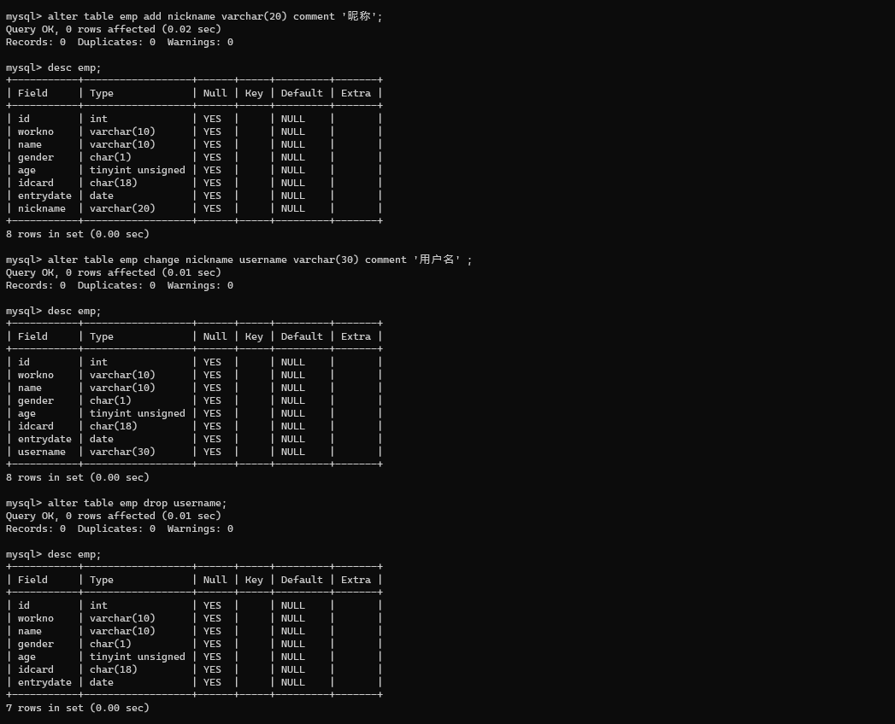

**修改表名** `ALTER TABLE 表名 RENAME TO 新表名`


例子： 将`emp`表名修改位`employee`。

`alter table emp rename to employee;`

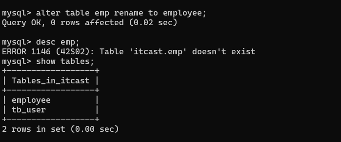

#### （6）表操作-删除
**删除表**： `DROP TABLE[IF EXISTS] 表名`；

**删除指定表，并重新创建该表**：`TRUNCATED TABLE 表名`;

----------------
### 4. MySQL图形化界面工具： DataGrip
[DataGrip](https://www.jetbrains.com/datagrip/)

----------------
### 5. DML语句（增加，修改以及删除）
#### （1）添加数据 `INSERT`
**给指定字段添加数据**： `INSERT INTO 表名(字段名1， 字段名2,...) VALUES(值1，值2，...);`

**给全部字段添加数据**: `INSERT INTO 表名 VALUES(值1，值2，...);`

**批量添加数据**

`INSERT INTO 表名(字段名1，字段名2,...) VALUES(值1，值2，...),(值1，值2，...),(值1，值2，...);`

`INSERT INTO 表名 VALUES(值1，值2，...),(值1，值2，...),(值1，值2，...);`

注意事项
   - 插入数据时，指定的字段顺序需要与值的顺序时一一对应的；
   - 字符串和日期类型数据应该包含在引号之中；
   - 插入的数据大小，应该在字段的规定范围之内；

例子：给employee表段添加一条数据。因为时添加完整的一条数据，所以有两种写法： 

`insert into employee(id, workno, name,gender,age,idcard,entrydate) values(1,'1','Itcast','男',10,'123456789012345678','2000-01-01');`

`insert into employee values(2, '2','Itcast2','男',18,'123456789012345678','2005-01-01');`

如果要一次性插入两条数据：

`insert into employee values(3, '3','Itcast3','男',38,'123456789012345678','2006-01-01'),(4, '4','Itcast4','男',48,'123456789012345678','2007-01-01');`

#### （2）修改数据 `UPDATE'

**修改数据**：`UPDATE 表名 SET 字段名1 = 值1, 字段名2 = 值2,...[WHERE 条件];`

例子1：更新id=1的数据。

`update employee set name = 'itcast1' where id = 1;`

`update employee set name = 'itcast1', gender = '女' where id = 1;`

例子2： 更新所有人的数据。

`update employee set entrydate = '2008-01-01';`


#### （3）删除数据 `DELETE`
**删除数据**： `DELETE FROM 表名 [WHERE 条件]`

例子1： 删除女性数据。

`delete from employee where gender = '女';`

例子2： 删除所有数据。

`delete from employee;`

注意：使用`UPDATE`和`DELETE`语句时，将对所有数据进行修改和删除，这是一个非常危险的操作。

----------------
### 6.DQL语句
#### （1）基本查询语句
**查询多个字段** 

`select 字段1, 字段2,... from 表名;`

`select * from 表名;`

**设置别名**

`select 字段1 [as 别名1], 字段2[as 别名2],... from 表名;`

**去除重复记录**

`select distinct 字段列表 from 表名;`

#### (2) 条件查询

`select 字段列表 from 表名 where 条件列表;`

